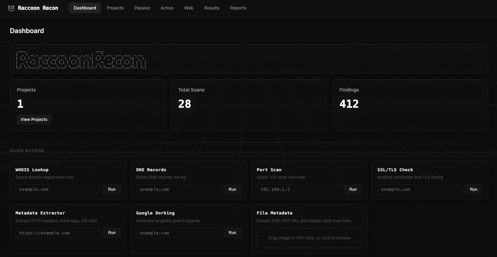

<p align="center">
  
</p>

<h1 align="center">🦝 Raccoon Recon</h1>

<p align="center">
  <strong>A web-based reconnaissance toolkit for penetration testing</strong><br>
  Built in Go &bull; Single binary &bull; Zero config
</p>

<p align="center">
  
  
  
  
</p>

<p align="center">
  
</p>

---

Raccoon Recon provides a sleek, dark-themed dashboard for conducting passive, active, and web reconnaissance during the information-gathering phase of a penetration test. All scan results are persisted in SQLite and can be exported as PDF or Markdown reports.

> 📚 Built for **IST-4620 Penetration Testing & Ethical Hacking** — Spring 2026

---

## ✨ Features

### 🔍 Passive Reconnaissance
| Tool | Description |
|------|-------------|
| **WHOIS Lookup** | Domain registration, registrar, nameservers |
| **DNS Records** | A, AAAA, MX, NS, TXT, SOA, CNAME via `dig` |
| **Subdomain Enumeration** | Discover subdomains via `theHarvester` |
| **DNS Recon** | Standard enumeration, reverse DNS, zone transfers via `dnsrecon` |
| **Google Dorking** | Auto-generated Google dork queries for target |
| **OSINT Aggregator** | Links to Shodan, Censys, VirusTotal, crt.sh, and more |

### ⚡ Active Reconnaissance
| Tool | Description |
|------|-------------|
| **Port Scanning** | TCP connect scans via `nmap` |
| **Service Detection** | Version detection with `nmap -sV` |
| **OS Fingerprinting** | OS detection with `nmap -O` |
| **Ping Sweep** | Live host discovery with `nmap -sn` |
| **Banner Grabbing** | Service banners via `nmap` or `netcat` |
| **Traceroute** | Network path discovery |
| **SNMP Enumeration** | SNMP tree walking via `snmpwalk` |

### 🌐 Web Reconnaissance
| Tool | Description |
|------|-------------|
| **HTTP Header Analysis** | Response headers via `curl` |
| **Technology Detection** | CMS/framework identification via `whatweb` |
| **Directory Discovery** | Brute-force directories via `gobuster` |
| **SSL/TLS Analysis** | Certificate details, cipher suites, TLS version *(built-in)* |
| **Robots.txt / Sitemap** | Fetch and parse *(built-in)* |
| **URL Metadata Extractor** | HTTP headers, HTML meta tags, OG data *(built-in)* |

### 📁 File Metadata Extraction
| File Type | What's Extracted |
|-----------|-----------------|
| **JPEG** | EXIF data — camera make/model, GPS coordinates, date taken, exposure, ISO, focal length, dimensions |
| **PNG** | Dimensions, tEXt/iTXt metadata chunks (author, description, software, creation time) |
| **PDF** | Title, author, creator, producer, page count, creation/modification dates, PDF version |

> 🗺️ GPS coordinates from photos are automatically linked to Google Maps!

### 🛠️ Platform
| Feature | Details |
|---------|---------|
| **Dashboard** | Quick-action cards for instant scans without navigating away |
| **Project Management** | Organize scans by engagement |
| **Real-time Output** | Live scan output streamed via WebSocket |
| **SQLite Database** | All results persisted for historical review |
| **Report Generation** | Export findings as Markdown or PDF |
| **File Upload** | Drag-and-drop image/PDF metadata extraction with preview |
| **Single Binary** | All templates, CSS, JS embedded — just run it |

---

## 🚀 Quick Start

```bash
# Clone
git clone https://github.com/jruggles656/raccoon-recon.git
cd raccoon-recon

# Build & Run
go build -o reconsuite .
./reconsuite
```

Open **http://localhost:8080** 🎉

---

## 📦 Prerequisites

Raccoon Recon auto-detects which tools are available. Missing tools are shown on the dashboard — built-in tools always work.

### macOS (Homebrew)
```bash
brew install go nmap whatweb gobuster
pip3 install theHarvester dnsrecon
```

### Debian / Ubuntu
```bash
sudo apt install golang nmap whatweb gobuster whois dnsutils \
  traceroute curl netcat-openbsd snmp
pip3 install theHarvester dnsrecon
```

### ✅ Built-in (no install needed)
- Google Dorking
- OSINT Aggregator
- SSL/TLS Analysis
- Robots.txt / Sitemap
- URL Metadata Extractor
- File Metadata Extractor (EXIF, PNG, PDF)

---

## ⚙️ Configuration

Edit `config.yaml`:

```yaml
server:
  host: "127.0.0.1"
  port: 8080

database:
  path: "reconsuite.db"

reports:
  directory: "./reports"
```

---

## 📂 Project Structure

```
raccoon-recon/
├── main.go                        # Entry point
├── config.yaml                    # Configuration
├── internal/
│   ├── config/config.go           # Config loading
│   ├── database/                  # SQLite schema, models, queries
│   │   ├── db.go                  # Database connection & migrations
│   │   ├── models.go              # Project, Scan, Result, Report structs
│   │   ├── migrations.go          # Schema definition
│   │   └── queries.go             # CRUD operations
│   ├── scanner/                   # Scan orchestration
│   │   ├── executor.go            # Scan lifecycle & routing
│   │   ├── builtin.go             # Built-in tools (SSL, dorking, OSINT, metadata)
│   │   ├── filemeta.go            # File metadata extraction (EXIF, PNG, PDF)
│   │   ├── specs.go               # CLI tool specifications
│   │   └── parsers.go             # Output parsers (whois, dig, nmap, curl)
│   ├── server/                    # HTTP server
│   │   ├── server.go              # Route registration & template loading
│   │   ├── handlers.go            # Page & API handlers
│   │   ├── websocket.go           # WebSocket hub for live output
│   │   └── middleware.go          # Logging, security headers, recovery
│   ├── tools/                     # Tool utilities
│   │   ├── common.go              # Tool runner (exec + streaming)
│   │   ├── validator.go           # Target validation
│   │   └── detect.go              # Installed tool detection
│   └── report/                    # Report generation
│       └── generator.go           # Markdown + PDF export
├── web/
│   ├── embed.go                   # Go embed directives
│   ├── templates/                 # HTML templates (embedded)
│   │   ├── layout.html            # Base layout with top navbar
│   │   ├── dashboard.html         # Dashboard with quick actions
│   │   ├── passive.html           # Passive recon page
│   │   ├── active.html            # Active recon page
│   │   ├── web.html               # Web recon page
│   │   ├── projects.html          # Project management
│   │   ├── results.html           # Results viewer
│   │   └── reports.html           # Report management
│   └── static/                    # Static assets (embedded)
│       ├── css/style.css          # Monochrome dark theme
│       ├── js/app.js              # Frontend logic
│       └── img/logo.svg           # 🦝 Raccoon logo
└── reports/                       # Generated report output
```

---

## 🔌 API Reference

| Method | Endpoint | Description |
|--------|----------|-------------|
| `GET` | `/api/projects` | 📋 List all projects |
| `POST` | `/api/projects` | ➕ Create project |
| `GET` | `/api/projects/{id}` | 📄 Get project details |
| `PUT` | `/api/projects/{id}` | ✏️ Update project |
| `DELETE` | `/api/projects/{id}` | 🗑️ Delete project |
| `POST` | `/api/scans` | 🚀 Start a scan |
| `GET` | `/api/scans/{id}` | 📊 Get scan status |
| `DELETE` | `/api/scans/{id}` | ❌ Cancel scan |
| `GET` | `/api/scans/{id}/results` | 📈 Get scan results |
| `GET` | `/api/scans/recent` | 🕐 Recent scans (last 10) |
| `POST` | `/api/reports` | 📝 Generate report |
| `GET` | `/api/reports/{id}/download` | ⬇️ Download report |
| `GET` | `/api/tools/status` | 🔧 Check installed tools |
| `GET` | `/api/stats` | 📊 Dashboard statistics |
| `POST` | `/api/upload/metadata` | 📁 Upload file for metadata extraction |
| `WS` | `/ws` | 🔴 WebSocket for live scan output |

---

## 🏗️ Tech Stack

| Component | Technology |
|-----------|-----------|
| **Backend** | Go standard library (`net/http`) |
| **Database** | SQLite via `modernc.org/sqlite` (pure Go, no CGO) |
| **WebSocket** | `github.com/coder/websocket` |
| **PDF Export** | `github.com/signintech/gopdf` |
| **Config** | `gopkg.in/yaml.v3` |
| **Frontend** | Vanilla JS, CSS custom properties |
| **Deployment** | Single binary with embedded assets via `embed.FS` |

---

<p align="center">
  <strong>🦝 Happy Recon!</strong><br>
  <sub>Built with ☕ and Go</sub>
</p>
